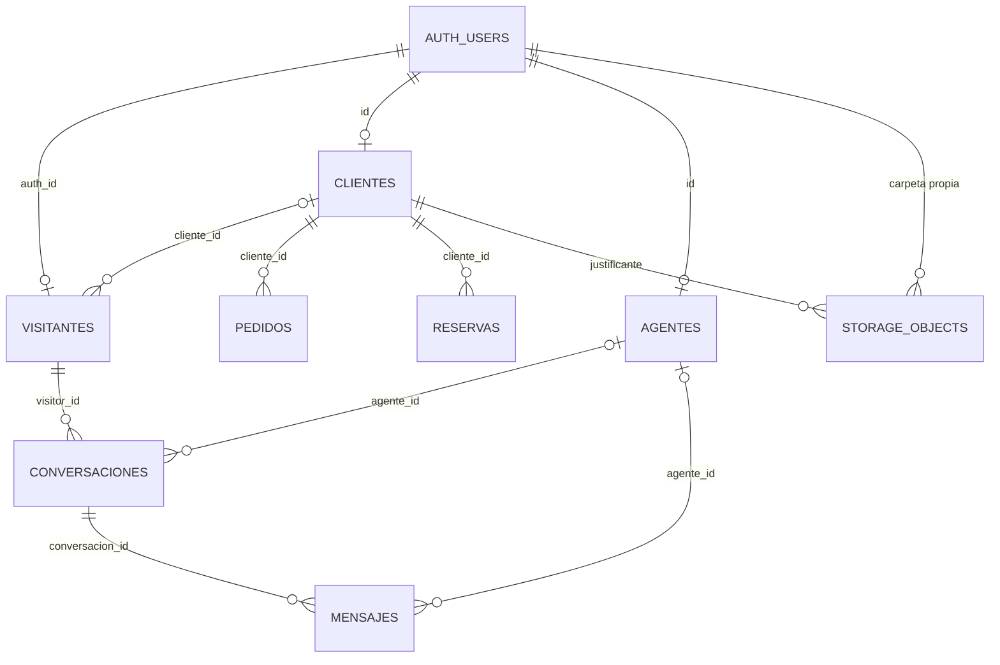

# Modelo de seguridad

Este documento describe el estado versionado. La web sigue siendo un
prototipo con datos demostrativos; aplicar las migraciones a un proyecto real
requiere una ventana coordinada y autorización explícita.

## Identidades y roles

- **Visitante**: sesión anónima de Supabase Auth. No crea una cuenta visible,
  pero obtiene un `auth.uid()` firmado. Solo ve su ficha, conversaciones y
  mensajes.
- **Cliente**: usuario autenticado por email. Ve su perfil, pedidos, reservas y
  chat vinculado. No puede aprobar su descuento ni editar columnas sensibles.
- **Usuario autenticado sin rol**: no obtiene capacidades de agente.
- **Agente**: `auth.uid()` debe existir en `public.agentes`. Puede leer la
  bandeja, responder por RPC, gestionar sus asignaciones y revisar descuentos.
- **Supervisor**: puede liberar asignaciones ajenas y cerrar o reabrir, pero no
  responder firmando dentro de la asignación de otra persona.
- **service_role**: solo para administración y montaje/limpieza de pruebas. No
  puede aparecer en el frontend, variables `VITE_*`, Git ni logs.

La anon key es pública por diseño. Permite llegar a Supabase, no saltarse JWT,
RLS ni la autorización interna de los RPC.

## Flujo del chat

1. El cliente público de Supabase reutiliza una sesión de cliente o crea una
   sesión anónima con `signInAnonymously()`.
2. `abrir_conversacion()` deduce el dueño mediante `auth.uid()`, crea o
   recupera su visitante y una conversación abierta.
3. El mensaje de bienvenida de Bananito se renderiza localmente y no se guarda.
4. `enviar_mensaje_visitante()` fija autor, conversación y fecha en servidor.
5. `responder_como_agente()` exige un agente registrado, fija su identidad y
   respeta la asignación.
6. Si la sesión corresponde a un cliente, `vincular_mi_visitante_a_cliente()`
   deduce el cliente del JWT. No acepta UUID de dueño por parámetro.

`localStorage` recuerda referencias y datos de interfaz, pero ningún UUID allí
autoriza acceso. El chat ya no recopila el user-agent.

## Datos y relaciones



Las tablas ejecutables y sus claves exactas viven en
`supabase/migrations/`; este diagrama es explicativo, no otra fuente de
esquema.

## RLS y escrituras privilegiadas

- No existe lectura anónima incondicional de `visitantes`, `conversaciones` o
  `mensajes`.
- No existe `INSERT` directo de conversaciones o mensajes ni `UPDATE` directo
  de conversaciones, reservas, agentes o clientes.
- Propietario, autor, agente, estados y fechas sensibles se deducen dentro de
  funciones `security definer` con `search_path = public`.
- Toda función propia está inventariada por firma exacta; se revoca `PUBLIC` y
  solo se concede `EXECUTE` a `anon` o `authenticated` cuando corresponde.
- Cerrar archiva; la aplicación no borra conversaciones. El borrado físico se
  reserva a administración fuera del navegador.

## Justificantes educativos

El bucket `descuentos-educativos` es privado. Un cliente solo puede escribir,
leer, sustituir y borrar el objeto canónico de su carpeta. El bucket limita el
tamaño a 5 MB y los MIME a PDF, JPEG y PNG. Un agente registrado puede leer y
obtiene una URL firmada de 60 segundos; no puede sobrescribir objetos ajenos.
`registrar_mi_justificante()` comprueba que el objeto existe antes de marcar la
solicitud como pendiente.

## Amenazas consideradas

- Enumeración con URL + anon key: RLS devuelve únicamente filas propias.
- UUID robado de `localStorage`: no sustituye al JWT y no concede acceso.
- Suplantación de bot/agente: no hay inserción directa; los RPC fijan autor.
- Escalada a supervisor: no hay actualización directa de `agentes`.
- Aprobación propia o cambio de orden en reservas: columnas sensibles solo se
  modifican por RPC autorizados.
- Funciones privilegiadas expuestas: auditoría de firmas y privilegios en
  `tests/schema/`.
- Justificantes ajenos o maliciosos: carpeta propia, bucket privado, tipos y
  tamaño limitados, rutas canónicas y URLs breves.

## Verificación aislada

La comprobación rápida y no destructiva usa PostgreSQL/PGlite:

```bash
npm run test:schema
```

GoTrue, PostgREST y Storage requieren Supabase local o un proyecto dedicado:

```bash
supabase start
supabase db reset
export RLS_TEST_URL=http://127.0.0.1:54321
export RLS_TEST_ANON_KEY=<anon local>
export RLS_TEST_SERVICE_KEY=<service_role local>
npm run test:rls
```

La suite crea y elimina usuarios, objetos y filas. Nunca debe apuntar al
proyecto demostrativo o de producción.

## Aplicación, recuperación y despliegue

1. Hacer copia de seguridad y verificar que Anonymous Sign-Ins está activo.
2. Probar todas las migraciones, en orden, en el entorno aislado.
3. Ejecutar 27/27 casos RLS sin omisiones.
4. Aplicar migraciones y frontend compatible en la misma ventana.
5. Verificar acceso visitante, cliente y agente; revisar logs sin imprimir
   tokens.

Si la migración falla, no desplegar el frontend. Restaurar la copia o corregir
mediante una migración posterior; no editar migraciones ya aplicadas. La
limpieza de `user_agent` es deliberada y no reversible desde la base salvo que
exista una copia previa; no afecta chats ni identidades.

## Demo frente a producción

Sin `VITE_SUPABASE_URL` y `VITE_SUPABASE_ANON_KEY`, la interfaz funciona en
modo demostrativo local: no envía mensajes a personas, no persiste pedidos ni
promete emails. Con Supabase configurado, RLS y los RPC anteriores son la
frontera de autorización. El estado no debe llamarse listo para producción
mientras la integración aislada siga omitida.
